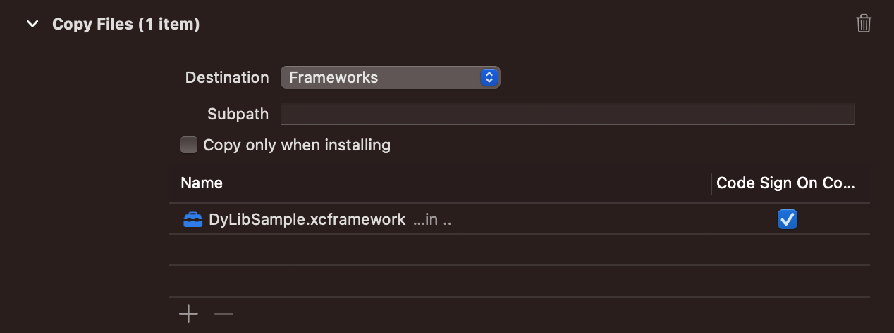
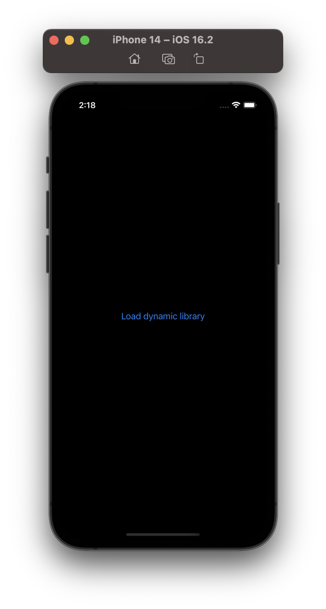
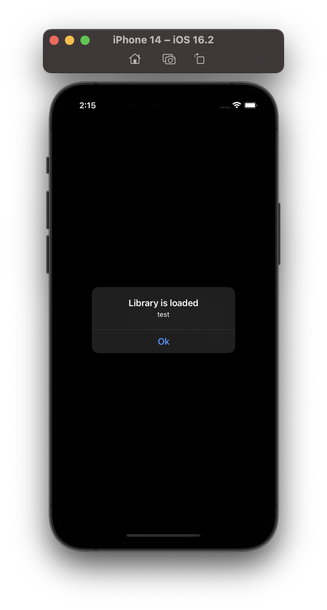

# DyLibRuntimeLoader
Lazy load the dynamic frameworks in runtime for iOS to reduce the App's launch time & more!


> *Binary is being loaded dynamically from SSD to RAM - Generated by AI*

## Dynamic loading
[Dynamic loading](https://en.wikipedia.org/wiki/Dynamic_loading) is a mechanism by which a computer program can, at run time, load a library (or other binary) into memory, retrieve the addresses of functions and variables contained in the library, execute those functions or access those variables, and unload the library from memory. 

It is one of the 3 mechanisms by which a computer program can use some other software; the other two are [static linking](https://en.wikipedia.org/wiki/Static_linking) and [dynamic linking](https://en.wikipedia.org/wiki/Dynamic_linking). Unlike static linking and dynamic linking, dynamic loading allows a computer program to start up in the absence of these libraries, to discover available libraries, and to potentially gain additional functionality.

## Dynamic loading for Apple platforms
MacOS officially supports Dynamic loading, you can follow the [Dynamic Library Programming Topics]( https://developer.apple.com/library/archive/documentation/DeveloperTools/Conceptual/DynamicLibraries/100-Articles/UsingDynamicLibraries.html). How about the iOS? Unfortunately, there aren't any official documents for iOS yet. Also, from the Xcode settings, we only see 2 options are static linking and dynamic linking, we assume Apple doesn't support Dynamic loading for iOS officially.

However, MacOS & iOS use the same [Darwin](https://en.wikipedia.org/wiki/Darwin_(operating_system)) kernel. Luckily, Darwin is mostly compatible with [POSIX](https://en.wikipedia.org/wiki/POSIX). POSIX introduced the [dlfcn](https://opensource.apple.com/source/dyld/dyld-132.13/include/dlfcn.h.auto.html) which is a standard instruction to work with run-time dynamic loading. You can see Apple open-sourced the [dylb](https://opensource.apple.com/source/dyld/) base on it.

This library bring the dynamic loading for iOS by using methods from POSIX's dlfcn.

## Interface modules
As the name, there're many benefits when using the [Interface modules](https://swiftrocks.com/reducing-ios-build-times-by-using-interface-targets) design. One of them is reducing the build time, today, along with dynamic loading, we'll get one more benefit: reduce the App's launch time: when App starts, it only load the interface modules, when app is running, it will load the concrete modules on demand by dynamic loading. You can see engineers in Meta has talked about this approach: [The evolution of Facebook’s iOS app architecture](https://engineering.fb.com/2023/02/06/ios/facebook-ios-app-architecture/). This library is mostly inspired from them!

---

## Installation
For now, we only support Swift Package Manager:
```swift
dependencies: [
    .package(url: "https://github.com/duyquang91/dylibruntimeloader", .from("1.0.0"))
]
```
> **Note**
> This is a dynamic library 

## How to use
These steps will guide you how to use the library, you can download this repo & open the Demo project, everything is there for a quick playground.
### Interface module
As mentioned above, it is a best practice to use this library with the [interface module](https://swiftrocks.com/reducing-ios-build-times-by-using-interface-targets) design. First, you have to create a new dynamic framework target. Declare all public protocol here:

```swift
import Foundation

public protocol SampleInterface {
    var version: String { get }
}

```
### Concrete module
Create a new dynamic framework target then add the interface module & **DyLibRuntimeLoader** as a dependency. Here, we implement the requirements from the interface module:

```swift
import Foundation
import DyLibSampleInterface
import DyLibRuntimeLoader

public struct Sample: SampleInterface {
    public var version: String {
        "test"
    }
}

@_cdecl("sample")
public func sample() -> UnsafeMutableRawPointer {
    return dyLibCreator(factory: Sample(), forType: SampleInterface.self)
}
```
> **Warning**: 
> You have to use the `@_cdecl("sample")` attribute, otherwise we can't retrieve the symbol to this concrete implementation later. Library also mentioned this in the method's inline documentation. 

Now, build & export this Concrete module to a dynamic XCFramework (or Fat framework). If you're using Swift Package Manager, can use this tool: [swift-create-xcframework](https://github.com/unsignedapps/swift-create-xcframework).

### Integration
Now, it is time to see the magic!

Open your iOS project & add 2 dependencies:
1. DyLibRuntimeLoader: Link dynamically
2. DyLibSampleInterface: Link dynamically

How about the concrete framework? We don't link it as the traditional way, our project & Xcode shouldn't see it: don't import or link it, just copy to the `Frameworks` directory by a new "Copy Files" in the "Build Phases":



Whenever you want to get any instances from the concrete module, just follow this method:

```swift
let sample = try dyLibLoad(withSymbol: "sample", fromFramework: FrameworkName.framework(name: "DyLibSample", directory: .frameworks), forType: SampleInterface.self)
```

> **Warning**:
> Use corresponding directory you copied the concrete framework into it, otherwise the framework can't be loaded.

If you setup correctly, the framework should be loaded:

| First launch | Loaded successfully | Failed to load |
| --- | --- | --- |
|  |  |  |

## Playground
You can try to open the IPA package in the simulator at path: 
```
~/Library/Developer/CoreSimulator/Devices/sim_uuid/Containers/Bundle/Application/app_uuid/IPA
```
Open the `Frameworks` folder & try to delete these frameworks & restart the app:

1. Delete `DyLibRuntimeLoader` or `Interface module` framework: App will be crashed immediately because they're linked dynamically. When app is launched, iOS will load all linked dynamic frameworks, if any is missing, app will crash.   
2. Delete `Concrete module` framework: App is launched normally because it is not linked dynamically, iOS doesn't know it is in the App's main bundle.

The playground above is an evident for the Dynamic loading for iOS with this library. Actually, you can use the POXIS's dlfcn APIs directly, very simple. This library just abstracts & makes it more Swifty.

By dynamic loading, the App's launch time will be reduced significantly, especially with the bunch of dynamic frameworks! 

## Appstore review
We're using the low level APIs with limited documentations from Apple. I will use this library for my current app on the Appstore to see if we can bypass the review from Apple, will update here ASAP.


